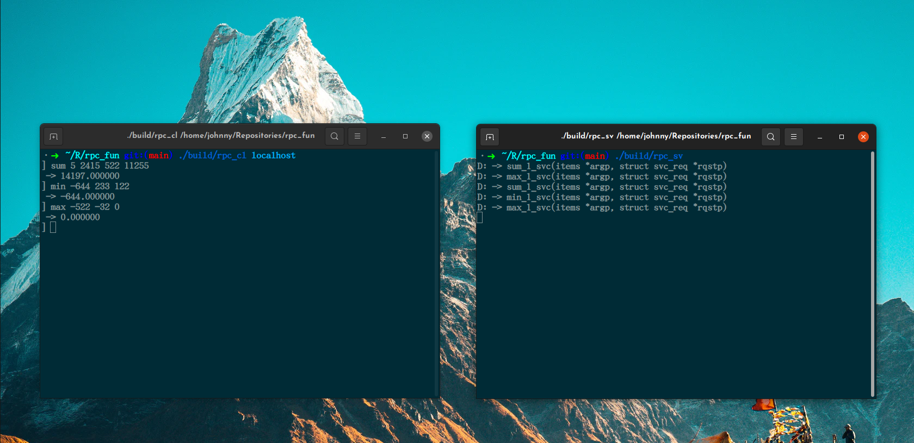

# RPC List Manipulator

This is coursework for my distributed systems & networking class. The server provides the following procedures (functions) to the clients: 
 - SUM(argument: a list of double-type numbers) – return the sum of the numbers; 
 - MAX(argument: a list of double-type numbers) – return the maximum of the numbers; 
 - MIN(argument: a list of double-type numbers) – return the minimum of the numbers.  


# Building

These instructions are for Debian-based operating systems, other operating systems should grab the `rpcbind` package from their favourite package manager.

1. Install `rpcbind`, `build-essentials`, and `cmake`.
```sh
sudo apt-get install rpcbind build-essential cmake
```

2. Generate the client and server RPC code.
```sh
cd ./src/rpc/
rpcgen -aC list.x
```

3. Assemble your build system and start building.
```sh
cd .
cmake . && make
```
